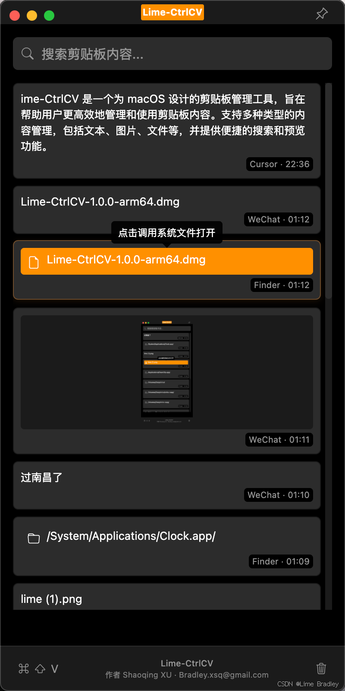

# Lime-CtrlCV 完全免费 本地化运行 

<div align="center">
  
</div>

## 🚀 快速开始


### 环境要求
- Node.js >= 14.0.0
- npm >= 6.0.0
- Git

### 本地运行

1. 克隆项目
```bash

git clone https://github.com/LIMEBRADLEY/LimeCtrlCV.git
cd Lime-CtrlCV
```
2. 安装依赖
```bash

npm install
```
3. 启动项目
```bash

npm start
```
4. 打包应用
```bash

npm run build
```

## 📖 项目简介
Lime-CtrlCV 是一个为 macOS 设计的剪贴板管理工具，旨在帮助用户更高效地管理和使用剪贴板内容。支持多种类型的内容管理，包括文本、图片、文件等，并提供便捷的搜索和预览功能。

## ✨ 功能特性
- 多类型内容支持
  - 文本：普通文本、URL链接
  - 图片：支持预览和缩放
  - 文件：支持文件预览和快速打开
- 快捷操作
  - 全局快捷键：`Command+Shift+V` 快速显示/隐藏
  - 窗口置顶：方便随时查看剪贴板历史
  - 智能搜索：快速定位历史记录
- 用户友好
  - 简洁美观的深色主题界面
  - 支持窗口大小调节
  - 支持文件拖拽
- 系统集成
  - 支持开机自启动
  - 系统托盘常驻
  - 原生窗口样式

## 🛠 技术实现
### 核心技术
- Electron：跨平台桌面应用框架
- Electron Store：本地数据持久化
- Bootstrap：UI框架和图标库

### 项目结构
limeCtrlCV/

├── main.js # 主进程：窗口管理、系统集成

├── renderer.js # 渲染进程：UI交互、剪贴板处理

├── index.html # 界面布局和样式

├── package.json # 项目配置

└── build/ # 构建资源


## 📝 版权和许可

MIT License

Copyright (c) 2024 Shaoqing XU, Lime Bradley.

[标准 MIT 许可证文本]

### 附加条款
1. 本项目仅供学习和参考使用。
2. 使用本项目代码时请遵守相关法律法规。
3. 如果您修改了代码，建议您开源共享以促进项目发展。
4. 在项目的所有副本中都必须包含版权声明和许可声明。

### 商标声明
- Lime-CtrlCV™ 是 Shaoqing XU 的商标。
- 其他所有商标均为其各自所有者的财产。

### 贡献者协议
通过向本项目提交任何代码或文档，您同意：
1. 您的贡献将遵循与本项目相同的 MIT 许可证。
2. 您拥有所提交内容的完整著作权或已获得相应授权。
3. 您授予项目维护者永久性的、全球范围内的许可，允许使用您的贡献。

## ⚠️ 免责声明

1. 使用责任
   - 本软件按"现状"提供，使用者需自行承担使用风险。
   - 作者不对因使用本软件而导致的任何直接或间接损失负责。
   - 用户应自行判断软件是否满足特定需求，并承担相应后果。

2. 数据安全
   - 本软件不会主动收集或上传用户的剪贴板数据。
   - 所有数据均存储在用户本地，用户应自行做好数据备份。
   - 不建议在剪贴板中存储敏感信息。

3. 第三方内容
   - 用户通过本软件访问的第三方内容与本软件无关。
   - 用户应遵守相关法律法规，合法使用第三方内容。
   - 本软件不对第三方内容的准确性、合法性负责。

## 📞 联系方式
- 作者：Shaoqing XU （Lime Bradley）
- 邮箱：Bradley.xsq@gmail.com
- Coded by Cursor
